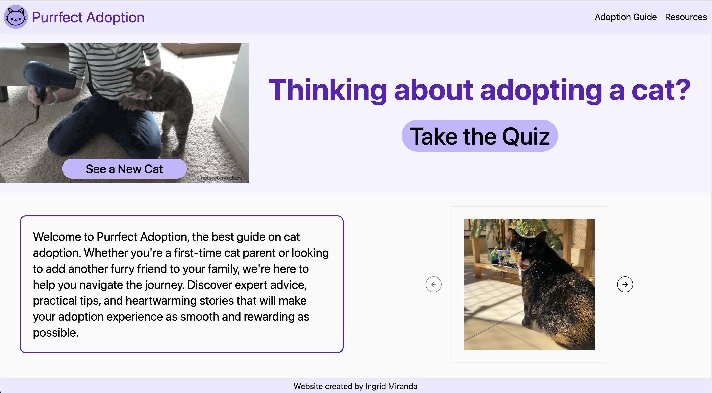
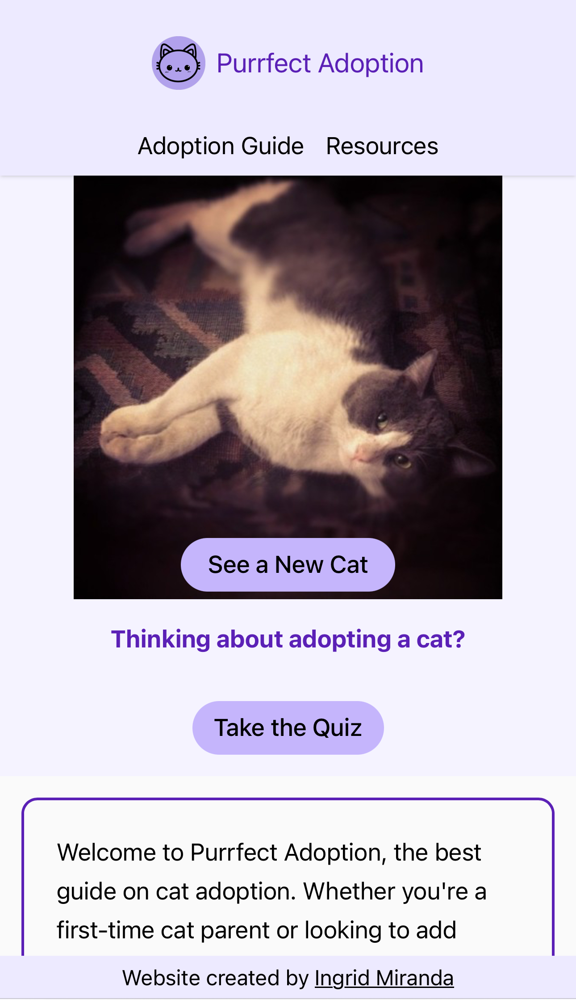
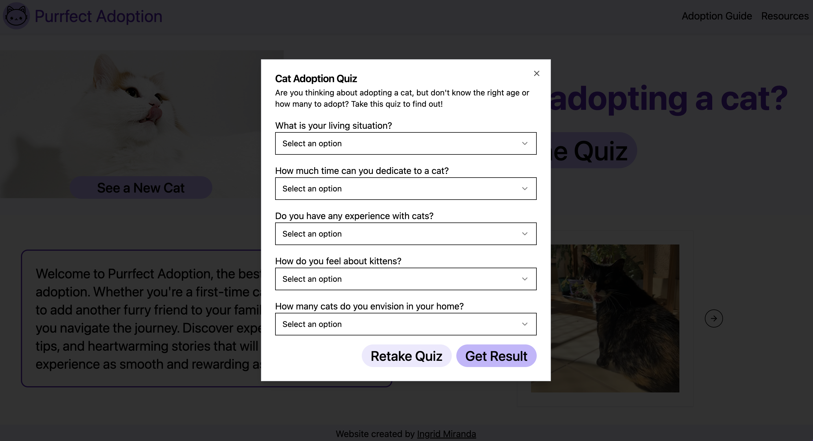

# Purrfect Adoption

**Purrfect Adoption** is a website designed to assist people in adopting a cat by matching them with the right age and number of cats based on their lifestyle. The site features:

- **A Quiz**: Helps users determine the best age and number of cats to adopt based on their lifestyle and preferences.
- **An Adoption Guide**: Provides a comprehensive, step-by-step guide through the entire adoption process, from research and preparation to post-adoption care.
- **Additional Resources**: A collection of links to other websites offering further information and support for new cat adopters.
- **Cat Pictures**: View an awesome cat picture every time you visit or click the "See a new cat" button.

Pages are responsive and the application runs as a single page web app.

## Deployed Website

https://purrfectadoption.netlify.app/

### Homepage Desktop



### Homepage Mobile



### Quiz



## Tech Stack

- React (Vite)
- Tailwind
- shadcn/ui
- 3rd Party API [TheCatAPI](https://developers.thecatapi.com/view-account/ylX4blBYT9FaoVd6OhvR?report=bOoHBz-8t)

## Installation

To install and run the application locally, follow these steps:

1. **Clone the repository:**

   ```bash
   git clone git@github.com:ingridmidia/purrfect-adoption.git
   ```

1. **Install dependencies:**

   ```bash
   npm i
   ```

1. **Run the application:**

   ```bash
   npm run dev
   ```

## About me

[**LinkedIn**](https://www.linkedin.com/in/ingrid-miranda-979b72b2/)

[**Porfolio**](https://ingridmiranda.netlify.app/)

[**GitHub**](https://github.com/ingridmidia)
